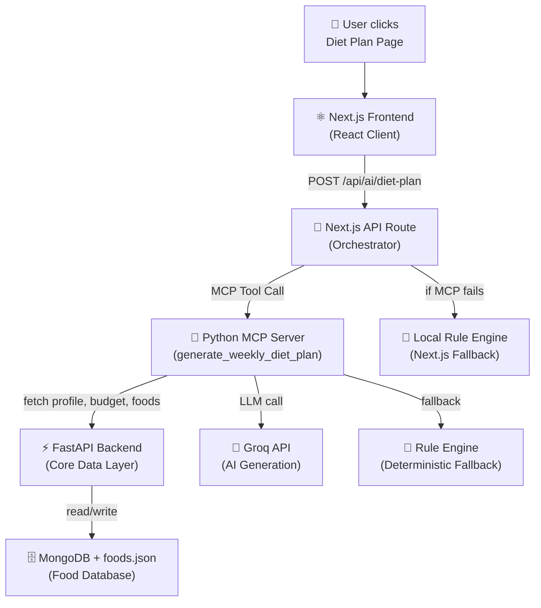
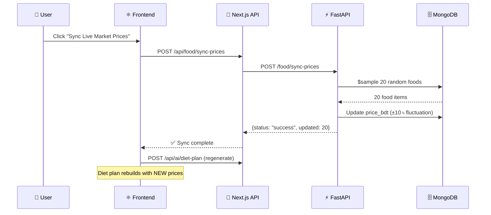
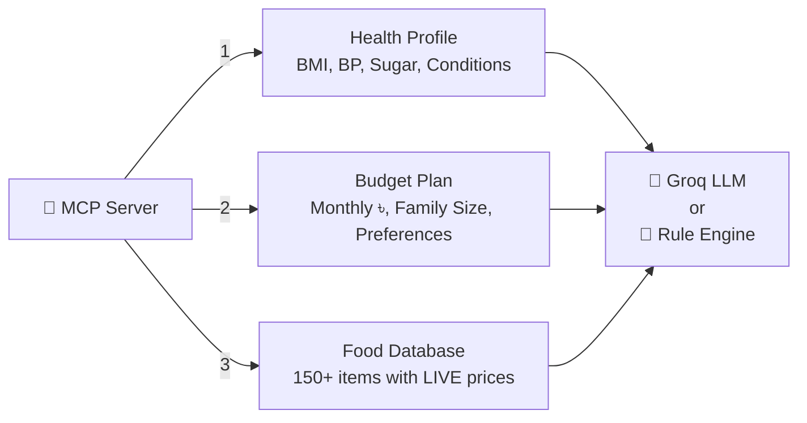
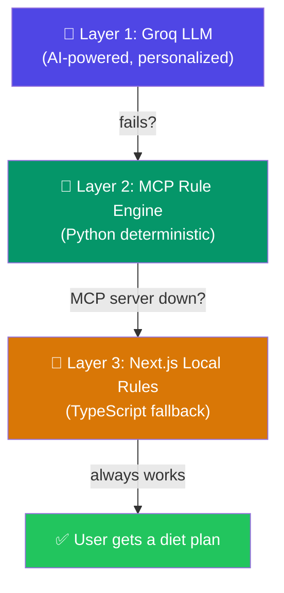

# 🍽️ Diet Plan — Complete Architecture & Pipeline

এই ডকুমেন্টটি হ্যাক্যাথনের জাজদের সামনে প্রেজেন্ট করার জন্য তৈরি। পুরো Diet Plan ফিচারটি কীভাবে শুরু থেকে শেষ পর্যন্ত কাজ করে, তার প্রতিটি ধাপ এখানে বিস্তারিত লেখা আছে।

---

## 🏗️ System Architecture (সিস্টেম আর্কিটেকচার)

পুরো সিস্টেমটি **৪টি লেয়ারে** কাজ করে:



| Layer | Technology | Role |
|---|---|---|
| **Frontend** | Next.js + React | UI, toggle, day tabs, sync button |
| **API Orchestrator** | Next.js API Route | Routes request to MCP or local fallback |
| **MCP Server** | Python + FastMCP | AI generation + Rule engine |
| **Backend** | FastAPI + MongoDB | Data storage, food DB, price sync |

---

## 📊 Food Database (খাবারের ডেটাবেস)

### কী আছে এখানে?
আমাদের কাছে **১৫০+ বাংলাদেশী খাবারের** একটি বিশাল ডেটাবেস আছে ([foods.json](file:///d:/99BugsInCode/backend/src/backend/data/foods.json))। প্রতিটি খাবারের জন্য নিচের তথ্যগুলো স্টোর করা আছে:

| Field | উদাহরণ | বিবরণ |
|---|---|---|
| `name_en` | "Hilsha (Ilish)" | ইংরেজি নাম |
| `name_bn` | "ইলিশ" | বাংলা নাম |
| `category` | "fish_meat" | ক্যাটাগরি (rice_grains, dal_pulses, vegetables, fruits, fish_meat) |
| `calories` | 273 | ক্যালরি পার সার্ভিং |
| `protein_g` | 22.0 | প্রোটিন (গ্রাম) |
| `price_bdt` | "150-300 ৳" | **বাংলাদেশের বাজারদর (BDT)** |
| `tags` | ["omega-3"] | স্মার্ট ট্যাগ (budget, premium-snack, staple, fried ইত্যাদি) |

### ক্যাটাগরি ব্রেকডাউন:
- **rice_grains** — ভাত, রুটি, পরাটা, খিচুড়ি, বিরিয়ানি, ওটস ইত্যাদি
- **dal_pulses** — মসুর, মুগ, ছোলা, মাষকলাই + বাদাম জাতীয়
- **fish_meat** — ইলিশ, রুই, তেলাপিয়া, চিকেন, বিফ, ডিম
- **vegetables** — পালং, লাউ, করলা, আলু, ফুলকপি
- **fruits** — কলা, আম, পেয়ারা, আপেল

> [!TIP]
> **জাজদের বলুন:** "আমরা জেনেরিক Western food database ব্যবহার করিনি। আমরা নিজেরা ১৫০+ দেশীয় বাংলাদেশী খাবারের একটি কিউরেটেড ডেটাবেস তৈরি করেছি, যেখানে প্রতিটি খাবারের BDT মূল্য, বাংলা নাম এবং ম্যাক্রোনিউট্রিয়েন্ট তথ্য আছে।"

---

## 🔄 Live Price Sync (লাইভ দাম আপডেট)

### কীভাবে কাজ করে?

Diet Plan পেজে একটি **"Sync Live Market Prices"** বাটন আছে। এটি ক্লিক করলে নিচের চেইনটি কাজ করে:



### The Sync Logic ([food_item.py:L112-133](file:///d:/99BugsInCode/backend/src/backend/service/food_item.py#L112-L133)):
1. MongoDB থেকে `$sample` অপারেটর দিয়ে **২০টি র‍্যান্ডম খাবার** সিলেক্ট করে
2. প্রতিটি খাবারের বর্তমান দাম (যেমন `"45 ৳"`) থেকে সংখ্যাটি extract করে
3. সেই দামের সাথে **±১০ টাকা পর্যন্ত র‍্যান্ডম পরিবর্তন** যোগ করে (Market Fluctuation Simulation)
4. নতুন দাম MongoDB-তে `update_one` দিয়ে সেভ করে
5. **সাথে সাথে পুরো Diet Plan রি-জেনারেট হয়** নতুন দাম দিয়ে

### Web Scraper for Food Discovery ([food_item.py:L42-110](file:///d:/99BugsInCode/backend/src/backend/service/food_item.py#L42-L110)):

> [!IMPORTANT]
> এটি একটি আলাদা ফিচার! যখন কোনো খাবার আমাদের ডেটাবেসে নেই, তখন এই স্ক্র্যাপার কাজ করে।

**`discover_food("Chicken Biryani")`** কল করলে কী হয়:
1. **DuckDuckGo-তে সার্চ করে:** `"price of Chicken Biryani in bangladesh bdt"`
2. **BeautifulSoup দিয়ে HTML পার্স করে** — সার্চ রেজাল্টের snippets থেকে দাম extract করে
3. **Regex দিয়ে BDT দাম খোঁজে:** `BDT|Tk|৳|Taka` এর পাশের সংখ্যা ধরে
4. **Smart Macro Estimation:** খাবারের নামের keyword দেখে ক্যালরি অনুমান করে (chicken/beef → high protein, salad → low calorie)
5. **MongoDB-তে সেভ করে** স্থায়ীভাবে — পরবর্তীতে এই খাবারটি ডায়েট প্ল্যানে ব্যবহার হতে পারে

```python
# Example: DuckDuckGo scraping for live price
query = f"price of {food_name} in bangladesh bdt"
url = f"https://html.duckduckgo.com/html/?q={query}"
# Parse HTML → extract BDT price → save to MongoDB
```

> [!TIP]
> **জাজদের বলুন:** "We have a real web scraping pipeline using DuckDuckGo and BeautifulSoup. When a user asks about an unknown food, our system automatically scrapes its Bangladesh market price and nutrition data, then permanently saves it to our database for future use."

---

## 🧠 The AI + Rule Hybrid Pipeline (মূল পাইপলাইন)

### ধাপ ১: ইউজার রিকোয়েস্ট (Frontend → API)
ইউজার Diet Plan পেজে আসলে [page.tsx](file:///d:/99BugsInCode/frontend/src/app/(dashboard)/diet-plan/page.tsx) থেকে `generateDietPlan()` কল হয়, যা [ai.service.ts](file:///d:/99BugsInCode/frontend/src/services/ai.service.ts#L15-L26) এর মাধ্যমে `POST /api/ai/diet-plan` রিকোয়েস্ট পাঠায়।

### ধাপ ২: API Orchestrator ([route.ts](file:///d:/99BugsInCode/frontend/src/app/api/ai/diet-plan/route.ts#L287-L322))
Next.js API রিকোয়েস্ট পেয়ে:
1. ইউজারের সেশন থেকে `user_id` বের করে
2. **MCP সার্ভারকে কল করে:** `callMcpTool("generate_weekly_diet_plan", { user_id })`
3. MCP থেকে সফল রেসপন্স পেলে সরাসরি ফ্রন্টএন্ডে পাঠিয়ে দেয়
4. MCP ফেইল করলে → **Local Fallback** অ্যাক্টিভেট হয়

### ধাপ ৩: MCP Server — The Core Brain ([app.py:L150-161](file:///d:/99BugsInCode/mcp_99bugsincode/src/mcp_99bugsincode/app.py#L150-L161))
MCP সার্ভার ৩টি ডেটা সোর্স থেকে তথ্য সংগ্রহ করে:



| ডেটা সোর্স | কোথা থেকে আসে | কী তথ্য থাকে |
|---|---|---|
| Health Profile | `GET /health/user/{id}` | BMI, BP, Blood Sugar, Conditions, Allergies |
| Budget Plan | `GET /budget/user/{id}` | Monthly Budget (BDT), Family Size, Preferred/Avoided Foods |
| Food Items | `GET /food` | ১৫০+ খাবার with **live prices** |

### ধাপ ৪: AI Generation — Groq LLM ([meal_plan.py:L202-244](file:///d:/99BugsInCode/mcp_99bugsincode/src/mcp_99bugsincode/meal_plan.py#L202-L244))

MCP সার্ভার প্রথমে **Groq LLM (Llama 3.3 70B)** কে কল করে। এই কলে যা পাঠানো হয়:

```
📋 Prompt Structure:
├── 📌 Strict JSON format instruction
├── 💊 User's health conditions & allergies
├── 💰 Budget info (monthly BDT, family size)
└── 🏷️ LIVE FOOD PRICES (top 50 items with name, price, calories, protein)
```

> [!IMPORTANT]
> **জাজদের বলুন:** "আমরা শুধু AI-কে বলিনি 'একটা ডায়েট দাও'। আমরা AI-কে আমাদের ডেটাবেসের **বাস্তব বাজারদরের একটি লিস্ট** দিয়ে দিই, যাতে AI এমন খাবার সাজেস্ট না করে যা ইউজারের বাজেটের বাইরে।"

AI-কে বলা হয়:
- ৭ দিনের প্ল্যান তৈরি করো (Sat-Fri)
- প্রতিদিন ৪ মিল: Breakfast, Lunch, Snack, Dinner
- **প্রতিটি মিলের cost BDT-তে ক্যালকুলেট করো LIVE PRICES ব্যবহার করে**
- ইউজারের অ্যালার্জি respect করো
- বাজেটের মধ্যে থাকো

### ধাপ ৫: Deterministic Rule Engine — The Safety Net ([meal_plan.py:L75-200](file:///d:/99BugsInCode/mcp_99bugsincode/src/mcp_99bugsincode/meal_plan.py#L75-L200))

যদি AI ফেইল করে (API key নেই, timeout, invalid JSON), তবে **গাণিতিক রুল ইঞ্জিন** কাজ শুরু করে। এটি কোনো AI ব্যবহার করে না, পুরোপুরি কোড-ভিত্তিক:

#### Budget Tier System:
| Monthly Budget | Tier | কী করে |
|---|---|---|
| < ৳5,000 | **Low** | সবচেয়ে সস্তা খাবার সিলেক্ট করে |
| ৳5,000 - ৳10,000 | **Mid** | মাঝারি দামের খাবার সিলেক্ট করে |
| > ৳10,000 | **High** | উচ্চমানের (কিন্তু ultra-premium নয়) খাবার সিলেক্ট করে |

#### Health Condition Adjustments:
| কন্ডিশন | কী পরিবর্তন হয় |
|---|---|
| **Hypertension (উচ্চ রক্তচাপ)** | Low-salt meals, "low-salt" tag যুক্ত হয় |
| **Diabetes (ডায়াবেটিস)** | Rice portion কমানো হয়, sugary snacks বাদ, Guava + Roasted chickpeas দেওয়া হয় |
| **Overweight (ওজনাধিক্য)** | Dinner-এ Rice-এর বদলে Roti, ক্যালরি কমানো হয় |

#### Smart Food Selection ([pick_foods_by_category](file:///d:/99BugsInCode/mcp_99bugsincode/src/mcp_99bugsincode/meal_plan.py#L36-L65)):
1. ক্যাটাগরি অনুযায়ী ফিল্টার (fish_meat, vegetables, etc.)
2. ইউজারের **allergy ও avoided foods** বাদ দেয়
3. `premium-snack` ট্যাগওয়ালা আইটেম (কাজুবাদাম, আখরোট) ডালের মিলে যাতে না আসে সেটি নিশ্চিত করে
4. **দাম অনুযায়ী sort করে** Budget Tier অনুসারে সিলেক্ট করে
5. প্রতিটি মিলের cost, ডেইলি বাজেটের সিলিং (ceiling) দিয়ে cap করা হয়

---

## 🛡️ Triple Fallback Strategy (তিন-স্তরের ব্যাকআপ)

এটি আমাদের সিস্টেমের সবচেয়ে শক্তিশালী দিক। **ইউজার কখনোই খালি পেজ দেখবে না:**



| Layer | কখন কাজ করে | Source Label |
|---|---|---|
| **Groq LLM** | সবকিছু ঠিক থাকলে | `groq-mcp` |
| **MCP Rule Engine** | AI key নেই বা API timeout | `rules-mcp` |
| **Next.js Local Rules** | MCP সার্ভার ডাউন | `rules` |

> [!CAUTION]
> **জাজদের বলুন:** "We have a Triple Fallback Architecture. If the AI fails, a Python rule engine takes over. If the entire MCP server crashes, a TypeScript rule engine embedded in the Next.js API takes over. The user will ALWAYS get a working, budget-aware, health-conscious diet plan — no matter what goes wrong in our infrastructure."

---

## 🎯 Hackathon Pitch Summary

### English Pitch (জাজদের সামনে বলুন):

> *"Our Diet Plan is not a simple ChatGPT wrapper. It's a **Market-Aware, Budget-Conscious, Health-Adaptive** system with three key innovations:*
>
> *1. **Localized Food Database** — We curated 150+ authentic Bangladeshi foods with BDT prices, Bengali names, and full macronutrient data.*
>
> *2. **Live Price Pipeline** — We built a DuckDuckGo web scraper that discovers unknown foods and their Bangladesh market prices in real-time. Our sync mechanism simulates market fluctuations and regenerates meal plans with updated costs.*
>
> *3. **Triple Fallback Resilience** — AI (Groq LLM) generates personalized plans using live food prices. If AI fails, a Python rule engine takes over. If the entire MCP server crashes, a local TypeScript engine in Next.js takes over. The user NEVER sees a broken page.*
>
> *The result? A low-income family in Bangladesh can input their ৳4,000/month budget, their diabetes condition, and get a medically-safe, nutritionally-balanced, culturally-appropriate 7-day meal plan — with costs calculated from real market prices."*
