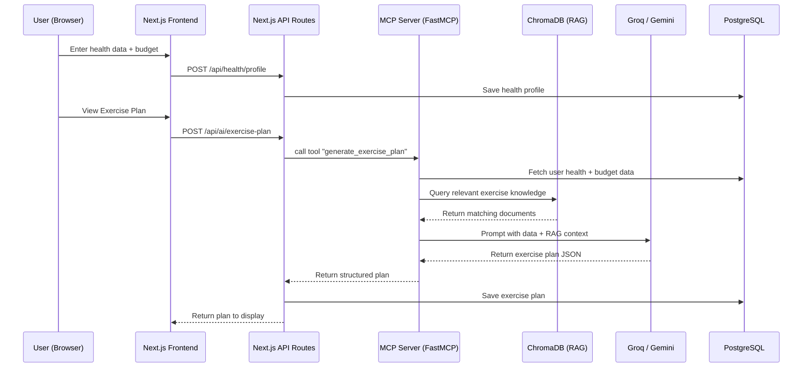

# NutriShastho AI — MCP-Powered Risk Factor, Exercise Plan & RAG Integration

Integrate the MCP server with AI (Gemini/Groq) to collect user health + expense data from the dashboard and generate: **risk factor analysis**, **physical exercise plans**, and lay the groundwork for **RAG-based** contextual recommendations.

## Current State Summary

| Layer | What exists today |
|---|---|
| **Frontend** (Next.js 16) | 9 dashboard pages — Health Input, Budget, Diet Plan, Risk Analysis, etc. already wired to backend |
| **Backend** (FastAPI) | Auth, Health Profile CRUD, Budget CRUD with Postgres via SQLAlchemy |
| **AI layer** | Next.js API routes (`/api/ai/risk-analysis`, `/api/ai/diet-plan`) call Groq → Gemini → fallback rules. Works, but runs entirely in Next.js route handlers — MCP server is unused |
| **MCP server** (`mcp_99bugsincode`) | Skeleton FastMCP app with a single mock `get_db` tool. Not connected to anything |
| **Data** | Hospital CSV (175 rows), health profiles in Postgres |

## User Review Required

> [!IMPORTANT]
> **MCP Server Role Clarification**: The MCP server currently has only a stub `get_db` tool. There are two approaches to integrating it:
>
> **Option A (Recommended)**: Build MCP tools that aggregate user data from the database and call Gemini/Groq to produce risk analysis + exercise plans. The Next.js API routes would then call the MCP server instead of directly calling Groq/Gemini. This makes the MCP server the single AI brain.
>
> **Option B**: Keep AI calls in Next.js routes and use MCP server only for database aggregation tools. Simpler but less "MCP-centric."
>
> **This plan follows Option A.**

> [!WARNING]
> **RAG requires a vector database**. The simplest approach for a hackathon-ready RAG is to:
> - Use **ChromaDB** (in-process, no external infra) to store health/nutrition knowledge embeddings
> - Embed a curated knowledge base of Bangladeshi health guidelines, exercise recommendations, and nutrition data
> - Query the vector store before prompting the LLM, injecting relevant context
>
> If you want a more production-grade RAG (e.g., Pinecone, Weaviate), let me know. ChromaDB keeps everything local and simple.

## Open Questions

1. **Exercise Plan Scope**: Should the exercise plan be a weekly schedule (like diet plan with 7 days) or a single daily routine? I'll assume **weekly schedule with daily variety**.
2. **RAG Knowledge Sources**: Should I seed the RAG knowledge base with:
   - Bangladeshi dietary guidelines (BIRDEM, NIPSOM)
   - WHO exercise recommendations
   - Common disease-exercise mappings (diabetes, hypertension, obesity)
   - The hospital CSV data?
   
   I'll include all of the above as embedded knowledge chunks.
3. **MCP Server Port**: Currently set to `7860`. Is that fine, or should it be different?

## Proposed Changes

### Component 1: MCP Server — The AI Brain

Transform the skeleton MCP server into a functional health intelligence engine with tools for risk analysis, exercise plan generation, and RAG-based queries.

---

#### [MODIFY] [pyproject.toml](file:///d:/99BugsInCode/mcp_99bugsincode/pyproject.toml)
Add dependencies: `google-genai`, `groq`, `chromadb`, `psycopg2-binary`, `sqlalchemy`, `python-dotenv`

#### [MODIFY] [app.py](file:///d:/99BugsInCode/mcp_99bugsincode/src/mcp_99bugsincode/app.py)
Complete rewrite — add these MCP tools:

1. **`get_user_health_data(user_id: str)`** — Fetches latest health profile + budget from Postgres
2. **`analyze_risk(user_id: str)`** — Aggregates health data → calls Groq/Gemini with RAG context → returns risk score, factors, explanations, recommendations
3. **`generate_exercise_plan(user_id: str)`** — Uses health profile + risk data + RAG context → generates personalized weekly exercise plan
4. **`query_health_knowledge(query: str)`** — RAG tool: searches embedded knowledge base and returns relevant health/exercise/nutrition information

#### [NEW] [rag.py](file:///d:/99BugsInCode/mcp_99bugsincode/src/mcp_99bugsincode/rag.py)
RAG engine module:
- Initialize ChromaDB collection on startup
- Seed with health knowledge documents (exercise guidelines, nutrition info, disease management)
- `search(query, top_k)` → returns relevant document chunks
- `add_documents(docs)` → for expanding the knowledge base

#### [NEW] [knowledge_base.py](file:///d:/99BugsInCode/mcp_99bugsincode/src/mcp_99bugsincode/knowledge_base.py)
Curated health knowledge data for RAG seeding:
- Bangladeshi dietary guidelines for common conditions
- Exercise recommendations by condition (diabetes, hypertension, obesity, underweight)
- WHO physical activity guidelines
- Age-appropriate exercise modifications
- Pregnancy/postpartum exercise safety

#### [NEW] [llm.py](file:///d:/99BugsInCode/mcp_99bugsincode/src/mcp_99bugsincode/llm.py)
LLM abstraction layer:
- `call_groq(prompt, system_prompt)` → Groq API call
- `call_gemini(prompt, system_prompt)` → Gemini API call  
- `call_llm(prompt, system_prompt)` → tries Groq first, falls back to Gemini
- JSON extraction and validation helpers

#### [NEW] [db.py](file:///d:/99BugsInCode/mcp_99bugsincode/src/mcp_99bugsincode/db.py)
Database access for MCP server:
- Connect to the same Postgres database as the backend
- Fetch health profile, budget data, and health history for a given user

---

### Component 2: Backend — New Exercise Plan Endpoint

Add a backend endpoint to store generated exercise plans.

---

#### [NEW] [ExercisePlan.py](file:///d:/99BugsInCode/backend/src/backend/model/ExercisePlan.py)
New SQLAlchemy model:
- `id`, `user_id`, `plan_data` (JSON — weekly schedule), `risk_level`, `source` (groq/gemini/rules), `created_at`

#### [NEW] [exercise_plan.py](file:///d:/99BugsInCode/backend/src/backend/schema/exercise_plan.py)
Pydantic schemas for exercise plan create/response

#### [NEW] [exercise_plan.py](file:///d:/99BugsInCode/backend/src/backend/service/exercise_plan.py)
Service: create and get_latest exercise plan

#### [NEW] [exercise_plan.py](file:///d:/99BugsInCode/backend/src/backend/controller/exercise_plan.py)
Controller: submit_exercise_plan, get_my_exercise_plan

#### [NEW] [exercise_plan.py](file:///d:/99BugsInCode/backend/src/backend/router/exercise_plan.py)
Router: `POST /exercise/plan`, `GET /exercise/plan`

#### [MODIFY] [app.py](file:///d:/99BugsInCode/backend/src/backend/app.py)
Register the new exercise plan router

#### [NEW] Alembic migration
Generate migration for the new `exercise_plans` table

---

### Component 3: Frontend — Exercise Plan Page + MCP Integration

Add a new Exercise Plan dashboard page and rewire AI calls to go through the MCP server.

---

#### [NEW] [exercise_plan.ts](file:///d:/99BugsInCode/frontend/src/types/exercise_plan.ts)
TypeScript types for exercise plan data

#### [MODIFY] [_backend.ts](file:///d:/99BugsInCode/frontend/src/app/api/health/_backend.ts)
Add: `callMcpTool(toolName, args)` — calls MCP server's HTTP endpoint, `callBackendExercisePlan`, `callBackendExercisePlanSubmit`

#### [NEW] [route.ts](file:///d:/99BugsInCode/frontend/src/app/api/ai/exercise-plan/route.ts)
New API route:
- Calls MCP `generate_exercise_plan` tool
- Falls back to rule-based exercise plan if MCP fails
- Saves result to backend

#### [MODIFY] [route.ts](file:///d:/99BugsInCode/frontend/src/app/api/ai/risk-analysis/route.ts)
Rewire to call MCP `analyze_risk` tool first, fall back to existing Groq/Gemini direct calls

#### [MODIFY] [ai.service.ts](file:///d:/99BugsInCode/frontend/src/services/ai.service.ts)
Add `generateExercisePlan()` function

#### [NEW] [page.tsx](file:///d:/99BugsInCode/frontend/src/app/(dashboard)/exercise-plan/page.tsx)
New dashboard page with:
- Weekly exercise schedule (tabs for each day like diet plan)
- Exercise cards showing: exercise name, duration, intensity, target area, calories burned
- Color-coded intensity levels (light/moderate/vigorous)
- Condition-specific warnings (e.g., "Avoid high-intensity if BP > 140")
- RAG-powered "Why this exercise?" explanations
- Regenerate button
- Risk-level badge showing which AI generated the plan

#### [MODIFY] [AppSidebar.tsx](file:///d:/99BugsInCode/frontend/src/components/layout/AppSidebar.tsx)
Add "Exercise Plan" navigation item with `Dumbbell` icon between Diet Plan and Risk Analysis

---

### Component 4: Frontend Environment

---

#### [MODIFY] [.env](file:///d:/99BugsInCode/frontend/.env)
Add `MCP_SERVER_URL=http://localhost:7860` and API keys forwarding

#### [MODIFY] [.env](file:///d:/99BugsInCode/mcp_99bugsincode/.env) [NEW]
Create env file with database URL, Gemini/Groq keys

---

## Architecture Flow

## Verification Plan

### Automated Tests
1. **MCP Server**: Start MCP server, call each tool via HTTP and verify JSON responses
2. **Backend**: Run `alembic upgrade head` to verify migration, test exercise plan CRUD endpoints with `curl`
3. **Frontend**: `npm run build` in frontend to verify no TypeScript errors
4. **Integration**: Start all 3 services (backend, MCP, frontend), navigate to Exercise Plan page, submit health data, and verify the full pipeline works

### Manual Verification
1. Log in → go to Health Input → enter test vitals (high BP, diabetes)
2. Go to Exercise Plan → verify plan is generated with condition-appropriate exercises
3. Go to Risk Analysis → verify MCP-powered analysis matches health data
4. Check that "Source" badges show correct AI provider (Groq/Gemini)
5. Verify RAG context is influencing recommendations (e.g., hypertension → low-intensity exercises)
